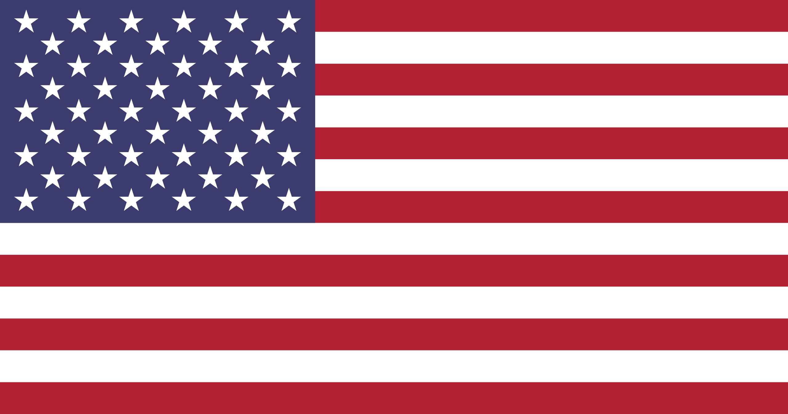

<<<<<<< HEAD
           

                

                    

                        
 <!-- Додано tabindex -->
                            

                                

                                    
                                

                                
En

                                

                                    <svg width="12" height="6" viewBox="0 0 8 5" xmlns="http://www.w3.org/2000/svg">
                                    <path d="M4 5l4-5H0z" fill="#465064"/>
                                    </svg>
                                

                            

                            

                              <a href="#" class="dropdown-item">
                                  
                                      
                                  
                                  Українська
                              </a>
                            

                        

                    

                

            

=======
Some text
>>>>>>> ace92e97c19fbea7adae5a9f0af2617eac354de4
